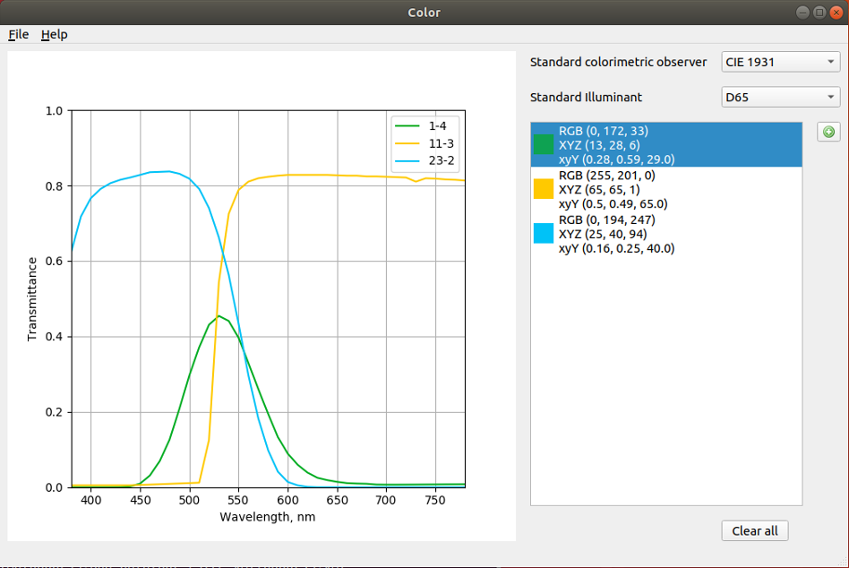

<h1 align="center">
  Color
</h1>

<div align="center">
  
</div>

## Description

Color is a


## Requirements

- Ubuntu / Windows
- Python 3
- PyQt5

## Installation

### Ubuntu

Python 3 + Qt5

```bash
sudo apt-get install pyqt5-dev-tools
pip3 install -r requirements.txt
cd color/
python3 color.py
```


1. https://www.flaticon.com/free-icon/
2. Mark James. SILK ICONS. famfamfam.com
